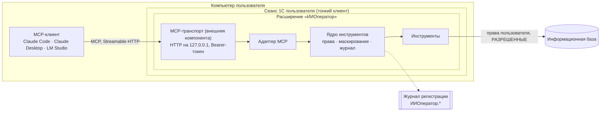
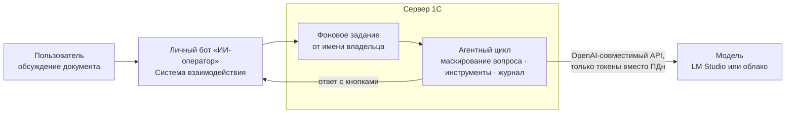
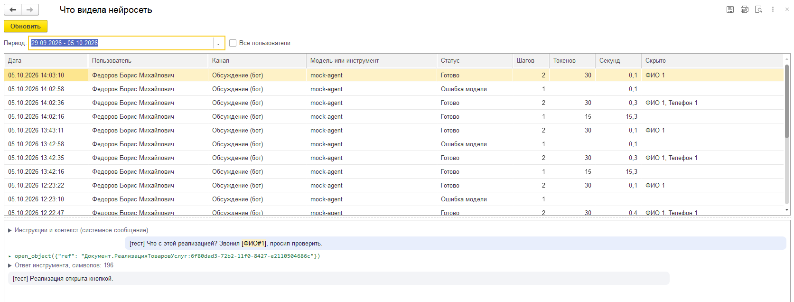

<p align="center"></p>

# ИИ-оператор: агент в сеансе пользователя 1С

**Агент внутри 1С, который работает от имени и с правами пользователя.** Пользователь пишет задачу обычными словами — в чате MCP-клиента (Claude Code, Claude Desktop, LM Studio) или боту «ИИ-оператор» прямо в обсуждении документа 1С. Результат открывается в штатных формах, отчётах и списках. Любые изменения данных показываются в форме предпросмотра и выполняются только после нажатия кнопки в 1С.

[](LICENSE)


<a href="https://infostart.ru/1c/articles/2811615/"></a>

О проекте на Инфостарте: [ИИ-оператор для 1С: нейросеть проводит документы, но кнопку «Выполнить» нажимаете вы](https://infostart.ru/1c/articles/2800981/).

Про надстройку для кадрового ЭДО: [ИИ-оператор управляет КЭДО](https://infostart.ru/1c/articles/2806328/), код — [RunetX/ai-operator-kedo](https://github.com/RunetX/ai-operator-kedo). Пакет для электронных транспортных накладных — [RunetX/ai-operator-epd](https://github.com/RunetX/ai-operator-epd).

Про маскирование персональных данных в вопросе пользователя: [Из Иванова приехали две фуры: как прятать персональные данные в падежах и прозвищах](https://infostart.ru/1c/articles/2807944/).

Про журнал операций, откат пакета и установку одной обработкой: [Кто распровёл квартал: журнал, откат и кнопка, которую жмёт человек](https://infostart.ru/1c/articles/2811615/).

---

## Содержание

- [Зачем это](#зачем-это)
- [Как это выглядит](#как-это-выглядит)
- [Бот в обсуждениях 1С](#бот-в-обсуждениях-1с)
- [Принципы](#принципы)
- [Архитектура](#архитектура)
- [Инструменты](#инструменты)
- [Пакеты](#пакеты)
- [Безопасность](#безопасность)
- [Требования](#требования)
- [Установка](#установка)
- [Подключение MCP-клиентов](#подключение-mcp-клиентов)
- [Тесты](#тесты)
- [Ограничения](#ограничения)
- [Компоненты и лицензии](#компоненты-и-лицензии)

---

## Зачем это

ИИ-оператор закрывает **рутину обычного пользователя** — бухгалтера, кадровика, менеджера, логиста.

| Что нужно пользователю | Как это решает ИИ-оператор |
|---|---|
| Видеть результат там, где он привык | Списки, отчёты и формы открываются **в его сеансе 1С**, а не только таблицей в чате |
| Доверять цифрам | Сначала **штатные отчёты**, свой запрос — запасной путь. В ответе всегда указан источник |
| Массово провести или отменить проведение документов | Пакетные действия с **предпросмотром в 1С**, журналом и откатом |
| Не отправлять персональные данные в облако | **Маскирование ПДн**: модель видит `[ФИО#1]`, пользователь в 1С видит реальные данные |
| Спросить, не выходя из 1С | **Бот в обсуждении документа**: вопрос там, где идёт работа, ответ с кнопками «Открыть» и «Предпросмотр» |

---

## Как это выглядит

Агент уточняет, о ком речь, и показывает документы в 1С, а не таблицей в чате (демо-база «Бухгалтерии предприятия 3.0»):

> **Пользователь:** Покажи реализации Суприма за февраль 2016 года.
>
> **Агент:** По «Суприм» нашлось 4 контрагента с одним ИНН 7799555712 — головная организация и три обособленных подразделения. Точного совпадения нет, поэтому уточните, по кому. <…> Нужен кто-то один или все четыре вместе?
>
> **Пользователь:** Тверь
>
> **Агент:** Открыл в 1С список «Реализация (акты, накладные, УПД)» с отбором — 2 документа по Суприм-Тверь за февраль 2016.

В сеансе пользователя открывается штатный список с отбором ровно по этим документам:


На вопрос о суммах агент берёт штатный отчёт, а не пишет свой запрос:

> **Пользователь:** Какая выручка от Суприм-Тверь за 1 квартал 2016 года?
>
> **Агент:** **Выручка от Суприм-Тверь за 1 квартал 2016 года — 1 400 000 руб.** (количество — 3 000).
>
> Источник: отчёт «Продажи по контрагентам» за 01.01.2016 – 31.03.2016, отбор по контрагенту Суприм-Тверь. Это обороты по кредиту счёта 90.01 «Выручка», сумма с НДС. Отчёт открыт у вас в 1С с теми же настройками.

Отчёт считается тем же механизмом, что и в его форме, поэтому итог совпадает с тем, что видит бухгалтер. У пользователя открывается тот же отчёт с тем же периодом и отбором:


Каждый вызов инструмента записывается в журнал регистрации 1С (`ИИОператор.ВызовИнструмента`) с аргументами, статусом и длительностью.

---

## Бот в обсуждениях 1С

Второй канал — бот Системы взаимодействия. Пользователь открывает обсуждение документа и пишет получателю «ИИ-оператор». MCP-клиент и токен не нужны: агентный цикл выполняется на сервере 1С, модель вызывается по OpenAI-совместимому API — локальная в LM Studio или облачная.

Пример с пакетом [ai-operator-epd](https://github.com/RunetX/ai-operator-epd), демо-база «Управления торговлей 11.5», модель Gemma 4 26B в LM Studio:

> **Менеджер** (в обсуждении реализации): Почему перевозчик не видит накладную?
>
> **ИИ-оператор:** Перевозчик не видит накладную, потому что титул Т1 подписан нами, но не ушел оператору ЭДО. Без движения документ находится уже 2 дня. Можно повторить отправку.
>
> `Предпросмотр` `Открыть ЭТрН`

«Предпросмотр» открывает у менеджера штатную форму плана, «Выполнить» нажимает он сам, бот пишет итог в ветку: «Готово: выполнено 1.»

- **Личный бот.** Для людей бот один, но у каждого пользователя свой экземпляр: он отвечает только владельцу и работает с его ролями и ограничениями доступа. Нажать кнопки под ответом может только владелец.
- **Вопрос маскируется до модели.** Людей из базы находят правила по справочникам с учётом падежей («позвони Королеву»), остальных — шаблоны и, если задана, локальная модель маскирования. Модель получает `Водитель [ФИО#1] говорит, что груз сдал`.
- **Сбой модели не обрывает разговор.** Сбой, который проходит сам, ход повторяет с паузами. Если модель недоступна или превышен лимит шагов, бот отвечает понятным текстом.

Каналу нужны платформа 8.3.25, небольшой патч конфигурации и регистрация базы в Системе взаимодействия: [раздел 6 инструкции](docs/install.md#6-бот-в-обсуждениях-1с).

---

## Принципы

1. **Работа с правами пользователя.** Инструменты выполняются с правами того, кто спросил: в его клиентском сеансе для MCP-клиента или в фоновом задании от его имени для бота. Никаких COM-соединений, веб-серверов и сервисных учётных записей.
2. **Изменения только через предпросмотр.** План действия показывается в форме 1С: объекты, что изменится, результаты проверок. Выполнение — только по кнопке. У модели нет другого пути к изменению данных.
3. **Отчёты приоритетнее запросов.** Цифры агента должны совпадать с тем, чему пользователь уже доверяет. Свой запрос — запасной путь, и тогда в ответе указан его текст.
4. **Тяжёлый запрос не кладёт базу.** Запрос выполняется в фоновом задании с таймаутом и отменой, под лимитом строк и длины текста, с `РАЗРЕШЕННЫЕ` и в безопасном режиме.
5. **Персональные данные не уходят модели.** Всё, что получает модель, проходит одну точку маскирования.
6. **Кто и что сделал — видно.** Аудит пишется в журнал регистрации, данные для отката — в отдельный регистр.
7. **Модель — любая.** В канале MCP ИИ-оператор — MCP-сервер, в канале бота он сам обращается к модели по OpenAI-совместимому API. Проверена работа с Claude Code, Claude Desktop и локальными моделями в LM Studio.

---

## Архитектура



- **MCP-транспорт** — своя внешняя компонента Native API под AGPL-3.0, исходники на Rust в [`addin/mcp-transport`](addin/mcp-transport/README.md). Готовые библиотеки для Windows x64 и x86 лежат в общем макете ядра `ИИО_ТранспортMCP`: ставится одно расширение, собирать ничего не нужно. Компонента поднимает MCP-сервер Streamable HTTP в сеансе пользователя и проверяет `Authorization: Bearer`, без токена сервер отвечает 401.
- **Адаптер MCP** передаёт компоненте описания инструментов и `instructions` от ядра, забирает вызовы и возвращает ответы, прогресс и отмену.
- **Ядро инструментов** не зависит от MCP. Единая точка вызова `ИИО_РеестрИнструментовКлиент.Вызвать` делает по порядку:
  1. проверяет роль;
  2. раскрывает токены ПДн во входных аргументах;
  3. вызывает обработчик и перехватывает его исключения;
  4. маскирует ответ;
  5. пишет вызов в журнал регистрации.
- **Долгие вызовы** (`run_query`, действия с предпросмотром, формы пакетов) отвечают отложенно: клиент получает результат, когда фоновое задание или пользователь в форме закончит работу, а пока идут уведомления о прогрессе.
- **Канал бота** использует то же ядро: серверный реестр инструментов с теми же проверками прав, маскированием и журналом. Ход агента выполняется в фоновом задании от имени владельца бота, история разговора и словарь маскирования хранятся в регистре, к которому нет доступа ни у одной роли.



- **Ошибки, которые модель может исправить** (синтаксис запроса, неизвестный объект, таймаут), возвращаются обычным результатом `{"error": {code, message, hint}}`, а не ошибкой протокола: некоторые клиенты показывают модели вместо неё только общую заглушку.

---

## Инструменты

Имена инструментов — на английском, описания для модели — на русском, все в одном макете `ИИО_ОписанияИнструментов`. Обязательные правила в описаниях (переспрашивать, отчёт раньше запроса, изменения только через предпросмотр) проверяются тестом.

| Инструмент | Что делает |
|---|---|
| `ping` | Проверка связи: версии расширения, конфигурации и платформы, дата сеанса 1С для относительных периодов |
| `describe_metadata` | Структура данных без самих данных: объекты, которые пользователь может читать, их реквизиты, табличные части, регистры и виртуальные таблицы, регистры движений документа |
| `run_query` | Запрос на языке 1С: фоновое задание, таймаут, `РАЗРЕШЕННЫЕ`, лимит строк, параметры из JSON, маскирование колонок с ПДн по происхождению полей |
| `find_ref` | Поиск объекта по тексту, как его ищет пользователь: штатный ввод по строке плюс поиск по словам наименования без кавычек и ОПФ, слово в другом падеже — по основе («Суприма» → «Суприм»). При неоднозначности модель переспрашивает |
| `show_in_1c`, `open_object` | Показ объектов в сеансе пользователя: штатный список с отбором по ссылкам, общий список для разных видов, форма объекта, структура подчинённости и движения документа |
| `related_objects` | Связанные документы на один уровень: на основании чего создан документ и что создано по нему |
| `explain_error` | «Что за ошибка?»: почему документ не проводится. Пробное проведение с правами пользователя в транзакции, которая всегда отменяется, плюс ошибки самого пользователя из журнала регистрации за последние минуты. Без ссылки — документ из активного окна 1С; в боте — документ обсуждения и кнопка «Открыть документ» |
| `print_documents` | Печать документов тем же путём, что и кнопка меню «Печать». Содержимое печатных форм модели не уходит |
| `list_reports`, `run_report` | Поиск отчёта по словам вопроса с учётом прав и формирование штатного отчёта тем же механизмом, что и в его форме: «Продажи» БП; выручка, задолженность клиентов и остатки на складах УТ. Пользователю открывается форма отчёта с теми же настройками, в боте — кнопкой «Открыть отчет» |
| `perform`, `undo` | Провести или отменить проведение пачки документов. План с проверками (права, блокировки, заполнение, дата запрета) открывается в форме предпросмотра. Изменения выполняются только по кнопке «Выполнить» и пишутся в журнал с данными для отката; `undo` возвращает прежнее состояние тем же путём |
| `close_forms` | Закрывает формы, которые ИИ-оператор открыл в сеансе; изменённые пользователем формы не трогает |

---

## Пакеты

Отраслевые сценарии добавляются отдельными расширениями-пакетами. Ядро находит пакет по подсистеме `<Префикс>_ИИО_Пакеты` и берёт из него инструменты, описания для модели, преднастройку маскирования и коды действий для разрешений. Пакет не заимствует объекты ядра, сбой пакета ядро не ломает.

| Пакет | Что делает |
|---|---|
| [ai-operator-kedo](https://github.com/RunetX/ai-operator-kedo) | Кадровый ЭДО в ЗУП 3.1 поверх расширения Контур.КЭДО: статусы сотрудников, диагностика, приглашения и ознакомление с ЛНА через штатные формы КЭДО |
| [ai-operator-epd](https://github.com/RunetX/ai-operator-epd) | Электронные транспортные накладные в УТ 11.5 на объектах БЭД: на каком титуле стоит перевозка, чей ход, причина ошибки или отказа, повторная отправка титула через предпросмотр |

---

## Безопасность

**Транспорт**
- Сервер слушает только `127.0.0.1`. Запросы с чужим `Origin` или `Host` получают 403, тело запроса — не больше 4 МБ.
- Каждый запрос должен нести `Authorization: Bearer <токен>`, токены сравниваются за постоянное время.
- Токен лежит в файле пользователя `%LOCALAPPDATA%\AiOperator\mcp-token`. Он не попадает ни в конфигурацию клиентов, ни в логи, ни в ответы модели. Без токена сервер не запускается.
- Лог компоненты `%LOCALAPPDATA%\AiOperator\mcp-transport.log` хранит только метод, код ответа и длительность запроса, без аргументов и ответов инструментов.
- **Самопроверка при запуске.** Сервер отправляет себе запрос без токена. Если ответ не 401 (например, из кеша платформы загрузилась старая компонента), сервер останавливается и пользователь видит причину.

**Права**
- Работать с агентом может только пользователь с ролью «Пользователь ИИ-оператора» или «Администратор ИИ-оператора» либо с полными правами: эти роли администратор выдаёт явно, автоматически в профили они не попадают. Право проверяется при запуске и при каждом вызове.
- Данные читаются с правами пользователя. В запросах всегда стоит `РАЗРЕШЕННЫЕ`, поэтому ограничения доступа на уровне записей работают как обычно.
- **Действия:**
  - разрешены, только если администратор разрешил их пользователю или его группе (регистр «Разрешения действий ИИ-оператора»). Без записи действие запрещено даже полноправному пользователю;
  - у пользователя должно быть право платформы («Проведение», «Отмена проведения»);
  - изменения выполняются только из формы предпросмотра: форма получает ключ подтверждения, без которого сервер ничего не меняет. У модели пути к изменениям нет.

**Персональные данные**
- Сервер помечает ПДн, клиент заменяет их токенами `[ФИО#1]`, `[ИНН#2]`, одинаковыми в пределах сеанса. Словарь токенов хранится только в памяти клиентского сеанса.
- Токены во входных аргументах модели раскрываются обратно, поэтому модель может сослаться на `[ФИО#1]` в следующем запросе.
- **Вопрос боту** маскируется до отправки модели: люди из базы — по справочникам с учётом падежей, остальные — по шаблонам и локальной модели маскирования, которой исходный текст уходит только по адресу в частной сети. Словарь разговора хранится в регистре на сервере. Сама переписка хранится в сервисе взаимодействия 1С, как любые обсуждения.
- Маскирование работает на нескольких уровнях:
  - **по виду объекта:** ссылки на физлиц. Для контрагентов проверяется каждая строка: маскируются только физлица и ИП;
  - **по полю:** реестр полей с ПДн по конфигурациям, включая контактную информацию;
  - **по происхождению колонки запроса:** цепочки полей прослеживаются через временные таблицы, вложенные запросы и составные типы;
  - **по шаблонам в любых строках:** ИНН из 12 цифр, телефон, СНИЛС, паспорт, email;
  - **по словарю:** значения, уже замаскированные в сеансе, заменяются и в свободном тексте, ФИО — ещё и в виде «Фамилия И.О.».
- Реестр правится в разделе «ИИ-оператор» → «Маскирование персональных данных» (форма «Что видит нейросеть»). В регистр пишутся только отличия от преднастройки.
- **Строгий режим** (флажок администратора в той же форме) скрывает и данные контрагентов-юрлиц: наименование, ИНН, КПП, адреса и контакты становятся токенами `[Контрагент#1]`. Суммы, цены, номера документов, товары и свои организации остаются открытыми. Цена режима: модель не сопоставит контрагентов по ИНН.

**Аудит**
- Все события пишутся в журнал регистрации с префиксом `ИИОператор.`: вызовы инструментов, запуск и остановка сервера, отказы самопроверки.
- Данные для отката пишутся в регистр в той же транзакции, что и само изменение.
- Действия запрещены, если журнал регистрации выключен; при запуске сервера пользователь видит предупреждение.
- **Журнал операций** (раздел «ИИ-оператор») показывает пакеты действий: кто, когда, что, результат по каждому объекту. Откатить пакет может его автор или администратор, через тот же предпросмотр.
- **Журнал обмена с моделью** (раздел «ИИ-оператор», форма «Что видела нейросеть») хранит то, что получила модель, ровно в том виде, в каком она это получила: ход бота — вопрос, ответы модели и инструментов; вызов инструмента MCP — аргументы и ответ клиенту. Персональные данные в нём — токены, словарь маскирования не пишется. Пользователь видит свои записи, администратор — все; срок хранения — 90 дней, меняется в настройках.



---

## Требования

| Компонент | Версия и примечания |
|---|---|
| Платформа 1С | 8.3.24 и выше. Проверено на 8.3.27 |
| Клиент | Тонкий клиент Windows x64 или x86. Веб-клиент, Linux и macOS не поддерживаются: компонента собрана только для Windows |
| Конфигурация | На БСП 3.1. Проверено на демо-базах «Бухгалтерии предприятия 3.0» и «Зарплаты и управления персоналом 3.1» |
| MCP-клиент | Claude Code, Claude Desktop и LM Studio (через `mcp-remote`, нужен Node.js) или любой клиент со Streamable HTTP и заголовками |
| Бот в обсуждениях | Платформа 8.3.25 и выше, режим совместимости конфигурации не ниже 8.3.25, патч конфигурации (`tools/install-bot-cfg.ps1`), база зарегистрирована в Системе взаимодействия. Модель с OpenAI-совместимым API и вызовом инструментов. Проверено на «Управлении торговлей 11.5» и «Бухгалтерии предприятия 3.0.198» |
| Установка из исходников | PowerShell 7 и Git. Rust не нужен |
| Для разработки | [YAxUnit](https://github.com/bia-technologies/yaxunit) 25.12 для тестов. Rust 1.98.1 с тулчейнами `stable-x86_64-pc-windows-gnu` и `stable-i686-pc-windows-gnu` и `dlltool` из WinLibs — только для пересборки компоненты (`tools/build-transport.ps1`) |

---

## Установка

Ставится одно расширение «ИИОператор»: MCP-сервер уже внутри него, Rust не нужен.

**Первый раз — [быстрый старт за 15 минут](docs/quickstart.md):** что понадобится, установка, токен, клиент и что спросить по каждой статье.

**Проще всего — установочная обработка.** Скачайте `ai-operator-installer-<версия>.epf` из последнего релиза в [Releases](https://github.com/RunetX/ai-operator-core/releases), откройте базу под администратором и выберите обработку через «Файл → Открыть». Обработка:
- проверит базу: платформа, режим совместимости, права, обновление, прежняя установка;
- покажет, что поставит: ядро, бот (если в конфигурации есть его патч) и пакеты для этой конфигурации — версии, совместимые друг с другом по `manifest.json` релизов;
- скачает файлы с GitHub, сверит SHA-256, запишет расширения со снятыми флагами «Безопасный режим» и «Защита от опасных действий» и включит в журнале регистрации уровень «Информация»;
- перезапустит 1С в форму «Состояние ИИ-оператора», где создаётся токен и настройки MCP-клиента.

Работает с файловыми и клиент-серверными базами. Подробно — [раздел 2 инструкции](docs/install.md#2-установка-в-базу).

Дальше — ручной путь: для Windows и файловой базы, клиент 1С на базе во время установки должен быть закрыт.

**Готовые расширения** ядра для «Бухгалтерии предприятия 3.0», «Зарплаты и управления персоналом 3.1» и «Управления торговлей 11.5» и бота (один файл для всех трёх) лежат в [Releases](https://github.com/RunetX/ai-operator-core/releases) файлами `.cfe`. Их можно загрузить в конфигураторе вместо `build.ps1`, затем снять у расширения флажки «Безопасный режим» и «Защита от опасных действий». Для другой конфигурации ядро ставится из исходников.

**Подробная инструкция по развёртыванию — [docs/install.md](docs/install.md):** установка из исходников, права и разрешения в 1С, рабочие места пользователей, обновление, удаление и частые ошибки.

```powershell
# 1. Клонировать репозиторий
git clone https://github.com/RunetX/ai-operator-core.git
cd ai-operator-core

# 2. Установить расширение «ИИОператор» в базу
./build.ps1 -InfoBase 'C:\Bases\Acc' -User 'Администратор'

```

Затем в 1С:
1. **Права.** Роли «ИИ-оператор: базовые права» и «ИИ-оператор: полные права» БСП сама добавляет в профили групп доступа: базовая не даёт доступа к агенту, полная — для профиля «Администратор». Для остальных ядро поставляет профили «ИИ-оператор» и «ИИ-оператор: администратор»: создайте с ними группы доступа и добавьте участников. Роль администратора ИИ-оператора открывает настройки, маскирование и разрешения.
2. **Разрешения действий.** Проведение и отмену проведения администратор разрешает пользователям или группам: раздел «ИИ-оператор» → «Разрешения действий ИИ-оператора». Без этого агент только читает и показывает.
3. **Журнал регистрации** должен писать уровень «Информация»: без аудита действия недоступны.
4. **Запуск.** Команда «ИИ-оператор» → «Запустить ИИ-оператор». Автоматический запуск при входе — параметр клиента `/C"ИИО_Запустить"`. Порт, таймауты и лимиты — в форме «Настройки ИИ-оператора».
5. **Токен и MCP-клиент.** Форма «ИИ-оператор» → «Состояние ИИ-оператора»: «Создать токен» (файл `%LOCALAPPDATA%\AiOperator\mcp-token`, на экран не выводится), затем «Настройки для Claude Code» или «… для Claude Desktop и LM Studio». В той же форме видно, что ещё не так: права, журнал, модель, пакеты, бот.

> При первом запуске на компьютере платформа показывает модальное окно «Внешняя компонента успешно установлена». Пока его не закрыть кнопкой «OK», сервер не стартует. Снова окно появится, только когда в новой версии изменится компонента.

Проверить сервер до настройки клиента: токен, порт, 401 без токена, инструменты, `ping`. На первой проблеме скрипт пишет, что сделать:

```powershell
./tools/check-connection.ps1
```

**Бот в обсуждениях** ставится в ту же базу дополнительно: патч конфигурации, расширение `-Bot`, регистрация в Системе взаимодействия и адрес модели в настройках. По шагам — [раздел 6 инструкции](docs/install.md#6-бот-в-обсуждениях-1с).

```powershell
./tools/install-bot-cfg.ps1 -InfoBase 'C:\Bases\Trade' -User 'Администратор'
./build.ps1 -InfoBase 'C:\Bases\Trade' -User 'Администратор' -Bot
```

---

## Подключение MCP-клиентов

Токен не хранится в конфигурации клиента: его подставляет скрипт из файла пользователя. Готовые настройки для своего компьютера дают кнопки формы «ИИ-оператор → Состояние ИИ-оператора»: «Настройки для Claude Code» и «Настройки для Claude Desktop и LM Studio». Форма пишет скрипты в `%LOCALAPPDATA%\AiOperator`.

**Claude Code** — файл `.mcp.json` в каталоге проекта. Заголовок авторизации печатает скрипт `mcp-headers.cmd`:

```json
{
  "mcpServers": {
    "onec": {
      "type": "http",
      "url": "http://127.0.0.1:9874/mcp",
      "headersHelper": "C:\\Users\\<пользователь>\\AppData\\Local\\AiOperator\\mcp-headers.cmd"
    }
  }
}
```

**Claude Desktop** и **LM Studio** подключаются через stdio-мост `mcp-bridge-<порт>.cmd`. Мост читает токен из файла и запускает `mcp-remote`:

```json
{
  "mcpServers": {
    "onec": {
      "command": "C:\\Users\\<пользователь>\\AppData\\Local\\AiOperator\\mcp-bridge-9874.cmd",
      "args": []
    }
  }
}
```

Для локальной модели нужен контекст не меньше 16k токенов. После обновления расширения перезапустите MCP-клиент: клиенты запоминают список инструментов при подключении. Подробнее, с настройками локальной модели и частыми проблемами: [docs/clients.md](docs/clients.md).

---

## Тесты

Модульные тесты YAxUnit — расширение «ИИОператор_Тесты»: маскирование, ядро, запросы, поиск, показ и печать в 1С, связи, отчёты, действия. Они рассчитаны на демо-базу «Бухгалтерии предприятия 3.0»: часть проверок опирается на её данные.

```powershell
./build.ps1 -InfoBase 'C:\Bases\Acc' -User 'Администратор' -Tests
./test.ps1 -InfoBase 'C:\Bases\Acc' -User 'Администратор'
```

- Тесты создают данные в транзакции и откатывают её.
- Кнопку «Выполнить» в предпросмотре тесты не нажимают: подтверждение — действие человека. Выполнение и откат проверяют серверные тесты с ключом подтверждения.

Тесты бота — расширение «ИИОператор_Бот_Тесты»: разбор ссылок, владелец бота, кнопки, итог действия. Проверка личных ботов пропускается, если база не зарегистрирована в Системе взаимодействия.

```powershell
./build.ps1 -InfoBase 'C:\Bases\Trade' -User 'Администратор' -Bot -Tests
./test.ps1 -InfoBase 'C:\Bases\Trade' -User 'Администратор' -Extension 'ИИОператор_Бот_Тесты'
```

---

## Ограничения

- Только тонкий клиент Windows и файловые базы проверены. Клиент-серверная база и терминальный сервер с несколькими пользователями одной базы пока не поддерживаются: порт задаётся на всю базу.
- В файловой базе отмена запроса кооперативная: запрос прерывается за несколько секунд, но очередь фоновых заданий освобождается не мгновенно.
- В канале MCP ФИО в другом падеже («Иванову») словарь маскирования в свободном тексте ответов не находит; вопрос боту маскируется с учётом падежей. Телефоны и почта в свободном тексте закрываются шаблонами и у юрлиц.
- Маскирование вопроса боту не идеально: человека, которого нет в базе, без локальной модели маскирования находят только шаблоны, а модель маскирования иногда ошибается на названиях мест и адресах.
- Боту нужен патч конфигурации, пока боты не появились в расширениях (платформа 8.5.5).
- Расширения ставятся без безопасного режима: MCP-сервер работает во внешней компоненте, а журналу операций нужен привилегированный режим.
- Действия ядра — проведение и отмена проведения. Создание и изменение документов пока не поддерживаются.

---

## Компоненты и лицензии

- **ИИ-оператор** — [GNU AGPL v3](LICENSE). Код можно использовать и менять, но если вы даёте пользоваться изменённой версией по сети, её исходный код нужно открыть этим пользователям.
- **MCP-транспорт** ([`addin/mcp-transport`](addin/mcp-transport/README.md)) — наша внешняя компонента, тоже под AGPL-3.0. Готовая сборка лежит в общем макете ядра `ИИО_ТранспортMCP`. Сборка воспроизводимая: `tools/build-transport.ps1 -Verify` собирает компоненту из исходников и сверяет её побайтно с `SHA256SUMS`. Зависимости — только с разрешительными лицензиями (MIT, Apache-2.0, BSD-3-Clause и др.), скрипт сборки их проверяет.
- **[YAxUnit](https://github.com/bia-technologies/yaxunit)** — модульные тесты 1С.

Автор — [RunetX](https://github.com/RunetX).
