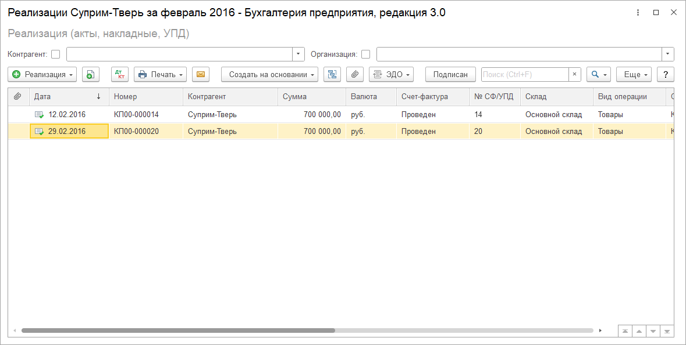
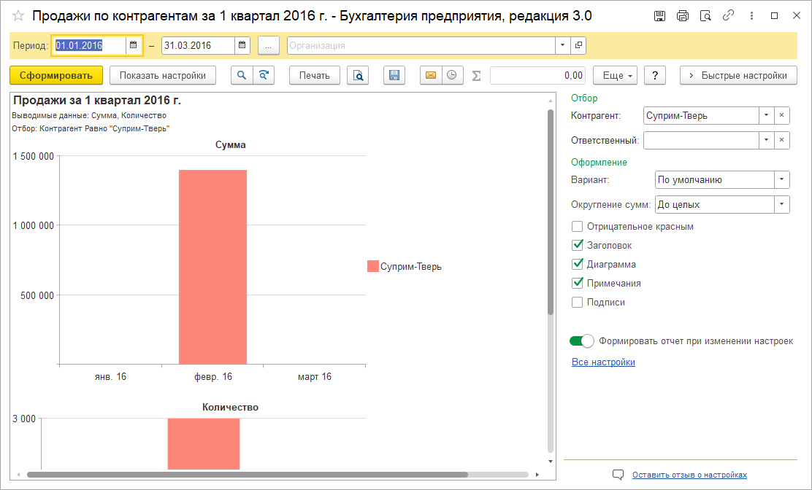
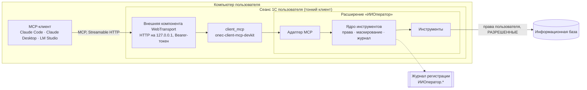

<p align="center"></p>

# ИИ-оператор: агент в сеансе пользователя 1С

**MCP-сервер внутри открытого сеанса 1С пользователя.** Пользователь пишет задачу обычными словами в чате с моделью, а агент выполняет её в 1С от имени и с правами этого пользователя. Результат открывается в штатных формах, отчётах и списках. Любые изменения данных показываются в форме предпросмотра и выполняются только после нажатия кнопки в 1С.

[](LICENSE)


<a href="https://infostart.ru/1c/articles/2800981/"></a>

О проекте на Инфостарте: [ИИ-оператор для 1С: нейросеть проводит документы, но кнопку «Выполнить» нажимаете вы](https://infostart.ru/1c/articles/2800981/).

---

## Содержание

- [Зачем это](#зачем-это)
- [Как это выглядит](#как-это-выглядит)
- [Принципы](#принципы)
- [Архитектура](#архитектура)
- [Инструменты](#инструменты)
- [Пакеты](#пакеты)
- [Безопасность](#безопасность)
- [Требования](#требования)
- [Установка](#установка)
- [Подключение MCP-клиентов](#подключение-mcp-клиентов)
- [Тесты](#тесты)
- [Ограничения](#ограничения)
- [Компоненты и лицензии](#компоненты-и-лицензии)

---

## Зачем это

ИИ-оператор закрывает **рутину обычного пользователя** — бухгалтера, кадровика, менеджера, логиста.

| Что нужно пользователю | Как это решает ИИ-оператор |
|---|---|
| Видеть результат там, где он привык | Списки, отчёты и формы открываются **в его сеансе 1С**, а не только таблицей в чате |
| Доверять цифрам | Сначала **штатные отчёты**, свой запрос — запасной путь. В ответе всегда указан источник |
| Массово провести или отменить проведение документов | Пакетные действия с **предпросмотром в 1С**, журналом и откатом |
| Не отправлять персональные данные в облако | **Маскирование ПДн**: модель видит `[ФИО#1]`, пользователь в 1С видит реальные данные |

---

## Как это выглядит

Агент уточняет, о ком речь, и показывает документы в 1С, а не таблицей в чате (демо-база «Бухгалтерии предприятия 3.0»):

> **Пользователь:** Покажи реализации Суприма за февраль 2016 года.
>
> **Агент:** По «Суприм» нашлось 4 контрагента с одним ИНН 7799555712 — головная организация и три обособленных подразделения. Точного совпадения нет, поэтому уточните, по кому. <…> Нужен кто-то один или все четыре вместе?
>
> **Пользователь:** Тверь
>
> **Агент:** Открыл в 1С список «Реализация (акты, накладные, УПД)» с отбором — 2 документа по Суприм-Тверь за февраль 2016.

В сеансе пользователя открывается штатный список с отбором ровно по этим документам:



На вопрос о суммах агент берёт штатный отчёт, а не пишет свой запрос:

> **Пользователь:** Какая выручка от Суприм-Тверь за 1 квартал 2016 года?
>
> **Агент:** **Выручка от Суприм-Тверь за 1 квартал 2016 года — 1 400 000 руб.** (количество — 3 000).
>
> Источник: отчёт «Продажи по контрагентам» за 01.01.2016 – 31.03.2016, отбор по контрагенту Суприм-Тверь. Это обороты по кредиту счёта 90.01 «Выручка», сумма с НДС. Отчёт открыт у вас в 1С с теми же настройками.

Отчёт считается тем же механизмом, что и в его форме, поэтому итог совпадает с тем, что видит бухгалтер. У пользователя открывается тот же отчёт с тем же периодом и отбором:



Каждый вызов инструмента записывается в журнал регистрации 1С (`ИИОператор.ВызовИнструмента`) с аргументами, статусом и длительностью.

---

## Принципы

1. **Работа в сеансе пользователя.** Инструменты выполняются в клиентском сеансе 1С с правами этого пользователя. Никаких COM-соединений, веб-серверов и сервисных учётных записей.
2. **Изменения только через предпросмотр.** План действия показывается в форме 1С: объекты, что изменится, результаты проверок. Выполнение — только по кнопке. У модели нет другого пути к изменению данных.
3. **Отчёты приоритетнее запросов.** Цифры агента должны совпадать с тем, чему пользователь уже доверяет. Свой запрос — запасной путь, и тогда в ответе указан его текст.
4. **Тяжёлый запрос не кладёт базу.** Запрос выполняется в фоновом задании с таймаутом и отменой, под лимитом строк и длины текста, с `РАЗРЕШЕННЫЕ` и в безопасном режиме.
5. **Персональные данные не уходят модели.** Всё, что получает модель, проходит одну точку маскирования.
6. **Кто и что сделал — видно.** Аудит пишется в журнал регистрации, данные для отката — в отдельный регистр.
7. **Модель — любая.** ИИ-оператор — MCP-сервер и не зависит от провайдера модели. Проверена работа с Claude Code, Claude Desktop и локальными моделями в LM Studio.

---

## Архитектура



- **[client_mcp](https://github.com/1c-neurofish/onec-client-mcp-devkit)** (v0.6.5) поднимает MCP-сервер внутри клиента 1С. Его BSL-код не меняется: расширение «ИИОператор» подключается к нему как провайдер инструментов через публичный API.
- **Внешняя компонента** собирается из форка `web-transport-addin` с проверкой `Authorization: Bearer`. Без токена сервер отвечает 401. Скрипт сборки заменяет в релизном `client_mcp.cfe` только макет компоненты.
- **Ядро инструментов** не зависит от MCP. Единая точка вызова `ИИО_РеестрИнструментовКлиент.Вызвать` делает по порядку:
  1. проверяет роль;
  2. раскрывает токены ПДн во входных аргументах;
  3. вызывает обработчик и перехватывает его исключения;
  4. маскирует ответ;
  5. пишет вызов в журнал регистрации.
- **Долгие вызовы** (`run_query`, действия с предпросмотром, формы пакетов) отвечают отложенно: клиент получает результат, когда фоновое задание или пользователь в форме закончит работу, а пока идут уведомления о прогрессе.
- **Ошибки, которые модель может исправить** (синтаксис запроса, неизвестный объект, таймаут), возвращаются обычным результатом `{"error": {code, message, hint}}`, а не ошибкой протокола: некоторые клиенты показывают модели вместо неё только общую заглушку.

---

## Инструменты

Имена инструментов — на английском, описания для модели — на русском, все в одном макете `ИИО_ОписанияИнструментов`. Обязательные правила в описаниях (переспрашивать, отчёт раньше запроса, изменения только через предпросмотр) проверяются тестом.

| Инструмент | Что делает |
|---|---|
| `ping` | Проверка связи: версии расширения, конфигурации и платформы, дата сеанса 1С для относительных периодов |
| `describe_metadata` | Структура данных без самих данных: объекты, которые пользователь может читать, их реквизиты, табличные части, регистры и виртуальные таблицы, регистры движений документа |
| `run_query` | Запрос на языке 1С: фоновое задание, таймаут, `РАЗРЕШЕННЫЕ`, лимит строк, параметры из JSON, маскирование колонок с ПДн по происхождению полей |
| `find_ref` | Поиск объекта по тексту, как его ищет пользователь: штатный ввод по строке плюс поиск по словам наименования без кавычек и ОПФ, слово в другом падеже — по основе («Суприма» → «Суприм»). При неоднозначности модель переспрашивает |
| `show_in_1c`, `open_object` | Показ объектов в сеансе пользователя: штатный список с отбором по ссылкам, общий список для разных видов, форма объекта, структура подчинённости и движения документа |
| `related_objects` | Связанные документы на один уровень: на основании чего создан документ и что создано по нему |
| `print_documents` | Печать документов тем же путём, что и кнопка меню «Печать». Содержимое печатных форм модели не уходит |
| `list_reports`, `run_report` | Поиск отчёта по словам вопроса с учётом прав и формирование штатного отчёта тем же механизмом, что и в его форме. Пользователю открывается форма отчёта с теми же настройками |
| `perform`, `undo` | Провести или отменить проведение пачки документов. План с проверками (права, блокировки, заполнение, дата запрета) открывается в форме предпросмотра. Изменения выполняются только по кнопке «Выполнить» и пишутся в журнал с данными для отката; `undo` возвращает прежнее состояние тем же путём |
| `close_forms` | Закрывает формы, которые ИИ-оператор открыл в сеансе; изменённые пользователем формы не трогает |

---

## Пакеты

Отраслевые сценарии добавляются отдельными расширениями-пакетами. Ядро находит пакет по подсистеме `<Префикс>_ИИО_Пакеты` и берёт из него инструменты, описания для модели, преднастройку маскирования и коды действий для разрешений. Пакет не заимствует объекты ядра, сбой пакета ядро не ломает.

| Пакет | Что делает |
|---|---|
| [ai-operator-kedo](https://github.com/RunetX/ai-operator-kedo) | Кадровый ЭДО в ЗУП 3.1 поверх расширения Контур.КЭДО: статусы сотрудников, диагностика, приглашения и ознакомление с ЛНА через штатные формы КЭДО |

---

## Безопасность

**Транспорт**
- Сервер слушает только `127.0.0.1`, браузерам разрешён только localhost.
- Каждый запрос должен нести `Authorization: Bearer <токен>`, токены сравниваются за постоянное время.
- Токен лежит в файле пользователя `%LOCALAPPDATA%\WebTransport\mcp-token`. Он не попадает ни в конфигурацию клиентов, ни в логи, ни в ответы модели.
- **Самопроверка при запуске.** Сервер отправляет себе запрос без токена. Если ответ не 401 (например, из кеша платформы загрузилась старая компонента), сервер останавливается и пользователь видит причину.

**Права**
- Работать с агентом может только пользователь с ролью «Пользователь ИИ-оператора» или «Администратор ИИ-оператора» либо с полными правами: эти роли администратор выдаёт явно, автоматически в профили они не попадают. Право проверяется при запуске и при каждом вызове.
- Данные читаются с правами пользователя. В запросах всегда стоит `РАЗРЕШЕННЫЕ`, поэтому ограничения доступа на уровне записей работают как обычно.
- **Действия:**
  - разрешены, только если администратор разрешил их пользователю или его группе (регистр «Разрешения действий ИИ-оператора»). Без записи действие запрещено даже полноправному пользователю;
  - у пользователя должно быть право платформы («Проведение», «Отмена проведения»);
  - изменения выполняются только из формы предпросмотра: форма получает ключ подтверждения, без которого сервер ничего не меняет. У модели пути к изменениям нет.

**Персональные данные**
- Сервер помечает ПДн, клиент заменяет их токенами `[ФИО#1]`, `[ИНН#2]`, одинаковыми в пределах сеанса. Словарь токенов хранится только в памяти клиентского сеанса.
- Токены во входных аргументах модели раскрываются обратно, поэтому модель может сослаться на `[ФИО#1]` в следующем запросе.
- Маскирование работает на нескольких уровнях:
  - **по виду объекта:** ссылки на физлиц. Для контрагентов проверяется каждая строка: маскируются только физлица и ИП;
  - **по полю:** реестр полей с ПДн по конфигурациям, включая контактную информацию;
  - **по происхождению колонки запроса:** цепочки полей прослеживаются через временные таблицы, вложенные запросы и составные типы;
  - **по шаблонам в любых строках:** ИНН из 12 цифр, телефон, СНИЛС, паспорт, email;
  - **по словарю:** значения, уже замаскированные в сеансе, заменяются и в свободном тексте, ФИО — ещё и в виде «Фамилия И.О.».
- Реестр правится в разделе «ИИ-оператор» → «Маскирование персональных данных». В регистр пишутся только отличия от преднастройки.

**Аудит**
- Все события пишутся в журнал регистрации с префиксом `ИИОператор.`: вызовы инструментов, запуск и остановка сервера, отказы самопроверки.
- Данные для отката пишутся в регистр в той же транзакции, что и само изменение.
- Действия запрещены, если журнал регистрации выключен; при запуске сервера пользователь видит предупреждение.
- **Журнал операций** (раздел «ИИ-оператор») показывает пакеты действий: кто, когда, что, результат по каждому объекту. Откатить пакет может его автор или администратор, через тот же предпросмотр.

---

## Требования

| Компонент | Версия и примечания |
|---|---|
| Платформа 1С | 8.3.24 и выше. Проверено на 8.3.27 |
| Клиент | Тонкий клиент Windows x64 или x86. Веб-клиент не поддерживается: компоненте нужен нативный клиент |
| Конфигурация | На БСП 3.1. Проверено на демо-базах «Бухгалтерии предприятия 3.0» и «Зарплаты и управления персоналом 3.1» |
| client_mcp | 0.6.5 с компонентой, проверяющей токен (`tools/build-client-mcp.ps1`) |
| MCP-клиент | Claude Code, Claude Desktop (через `mcp-remote`), LM Studio или любой клиент со Streamable HTTP и заголовками |
| Для сборки | PowerShell 7; Rust (rustup) с тулчейнами `stable-x86_64-pc-windows-gnu` и `stable-i686-pc-windows-gnu`; `dlltool.exe` из WinLibs; Node.js для `mcp-remote`; [YAxUnit](https://github.com/bia-technologies/yaxunit) 25.12 для тестов |

---

## Установка

Короткая инструкция для Windows и файловой базы. Клиент 1С на базе во время установки должен быть закрыт.

**Подробная инструкция по развёртыванию — [docs/install.md](docs/install.md):** подготовка сборочной машины, права и разрешения в 1С, рабочие места пользователей, обновление, удаление и частые ошибки.

```powershell
# 1. Клонировать репозиторий
git clone https://github.com/RunetX/ai-operator-core.git
cd ai-operator-core

# 2. Собрать client_mcp с компонентой, проверяющей Bearer-токен.
#    Скрипт скачает релиз client_mcp 0.6.5, сверит SHA-256, соберёт компоненту из исходников
#    и заменит в client_mcp только её макет. Результат — build/client_mcp-0.6.5-auth.cfe
./tools/build-client-mcp.ps1

# 3. Установить client_mcp и расширение «ИИОператор» в базу
./build.ps1 -InfoBase 'C:\Bases\Acc' -User 'Администратор' -ClientMcp build/client_mcp-0.6.5-auth.cfe

# 4. Выпустить токен (файл %LOCALAPPDATA%\WebTransport\mcp-token, на экран не выводится)
./tools/new-mcp-token.ps1
```

Затем в 1С:
1. **Права.** Роли «ИИ-оператор: базовые права» и «ИИ-оператор: полные права» БСП сама добавляет в профили групп доступа: базовая не даёт доступа к агенту, полная — для профиля «Администратор». Работать с агентом может пользователь с ролью «Пользователь ИИ-оператора» — её добавляют в профиль группы доступа явно. Роль «Администратор ИИ-оператора» открывает настройки, маскирование и разрешения.
2. **Разрешения действий.** Проведение и отмену проведения администратор разрешает пользователям или группам: раздел «ИИ-оператор» → «Разрешения действий ИИ-оператора». Без этого агент только читает и показывает.
3. **Журнал регистрации** должен писать уровень «Информация»: без аудита действия недоступны.
4. **Запуск.** Команда «ИИ-оператор» → «Запустить ИИ-оператор». Автоматический запуск при входе — параметр клиента `/C"ИИО_Запустить"`. Порт, таймауты и лимиты — в форме «Настройки ИИ-оператора».

> При первом запуске платформа показывает модальное окно «Внешняя компонента успешно установлена». Пока его не закрыть, сервер не стартует.

Проверить сервер до настройки клиента: токен, порт, 401 без токена, инструменты, `ping`. На первой проблеме скрипт пишет, что сделать:

```powershell
./tools/check-connection.ps1
```

---

## Подключение MCP-клиентов

Во всех способах токен читается из файла пользователя и не хранится в конфигурации клиента.

**Claude Code** — файл `.mcp.json` в каталоге проекта. Переменная раскрывается при запуске:

```json
{
  "mcpServers": {
    "onec": {
      "type": "http",
      "url": "http://127.0.0.1:9874/mcp",
      "headers": { "Authorization": "Bearer ${ONEC_MCP_TOKEN}" }
    }
  }
}
```

```powershell
$env:ONEC_MCP_TOKEN = (Get-Content "$env:LOCALAPPDATA\WebTransport\mcp-token" -Raw).Trim()
claude
```

**Claude Desktop** и **LM Studio** подключаются через stdio-мост [`tools/mcp-bridge.cmd`](tools/mcp-bridge.cmd). Мост читает токен из файла и запускает `mcp-remote`:

```json
{
  "mcpServers": {
    "onec": {
      "command": "cmd",
      "args": ["/c", "C:\\path\\to\\ai-operator-core\\tools\\mcp-bridge.cmd", "9874"]
    }
  }
}
```

Для локальной модели нужен контекст не меньше 16k токенов. После обновления расширения перезапустите MCP-клиент: клиенты запоминают список инструментов при подключении. Подробнее, с настройками локальной модели и частыми проблемами: [docs/clients.md](docs/clients.md).

---

## Тесты

Модульные тесты YAxUnit — расширение «ИИОператор_Тесты»: маскирование, ядро, запросы, поиск, показ и печать в 1С, связи, отчёты, действия. Они рассчитаны на демо-базу «Бухгалтерии предприятия 3.0»: часть проверок опирается на её данные.

```powershell
./build.ps1 -InfoBase 'C:\Bases\Acc' -User 'Администратор' -Tests
./test.ps1 -InfoBase 'C:\Bases\Acc' -User 'Администратор'
```

- Тесты создают данные в транзакции и откатывают её.
- Кнопку «Выполнить» в предпросмотре тесты не нажимают: подтверждение — действие человека. Выполнение и откат проверяют серверные тесты с ключом подтверждения.

---

## Ограничения

- Только тонкий клиент Windows и файловые базы проверены. Клиент-серверная база и терминальный сервер с несколькими пользователями одной базы пока не поддерживаются: порт задаётся на всю базу.
- В файловой базе отмена запроса кооперативная: запрос прерывается за несколько секунд, но очередь фоновых заданий освобождается не мгновенно.
- ФИО в другом падеже («Иванову») словарь маскирования в свободном тексте не находит. Телефоны и почта в свободном тексте закрываются шаблонами и у юрлиц.
- Расширения ставятся без безопасного режима: этого требует client_mcp, а журналу операций нужен привилегированный режим.
- Действия ядра — проведение и отмена проведения. Создание и изменение документов пока не поддерживаются.

---

## Компоненты и лицензии

- **ИИ-оператор** — [GNU AGPL v3](LICENSE). Код можно использовать и менять, но если вы даёте пользоваться изменённой версией по сети, её исходный код нужно открыть этим пользователям.
- **[onec-client-mcp-devkit](https://github.com/1c-neurofish/onec-client-mcp-devkit)** — MCP-сервер внутри клиента 1С, LGPL-3.0. Используется релизный `client_mcp.cfe` без изменений BSL-кода.
- **[web-transport-addin](https://github.com/alkoleft/web-transport-addin)** — внешняя компонента HTTP-транспорта. Проверка Bearer-токена добавлена в [форке](https://github.com/ui99ru/web-transport-addin). В исходном репозитории компоненты лицензия не указана, поэтому готовых сборок компоненты здесь нет: `tools/build-addin.ps1` собирает её из исходников форка на вашей машине.
- **[YAxUnit](https://github.com/bia-technologies/yaxunit)** — модульные тесты 1С.

Автор — [RunetX](https://github.com/RunetX).
